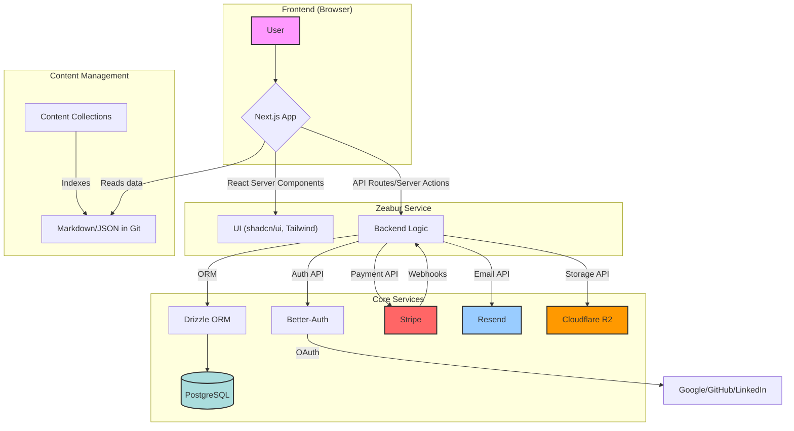
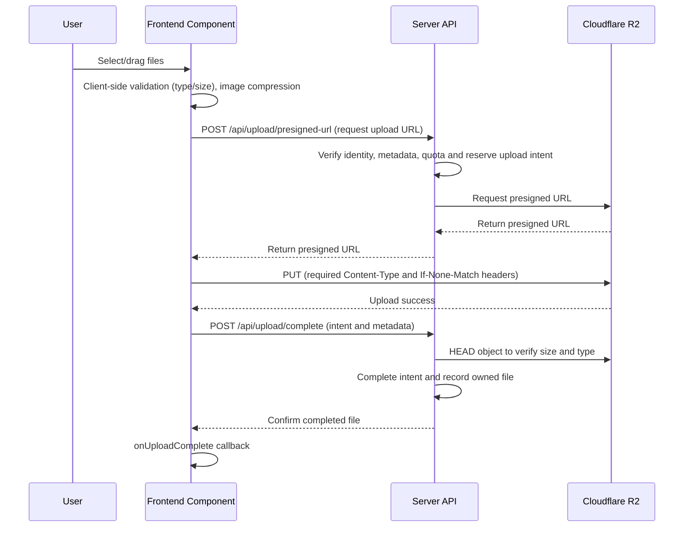
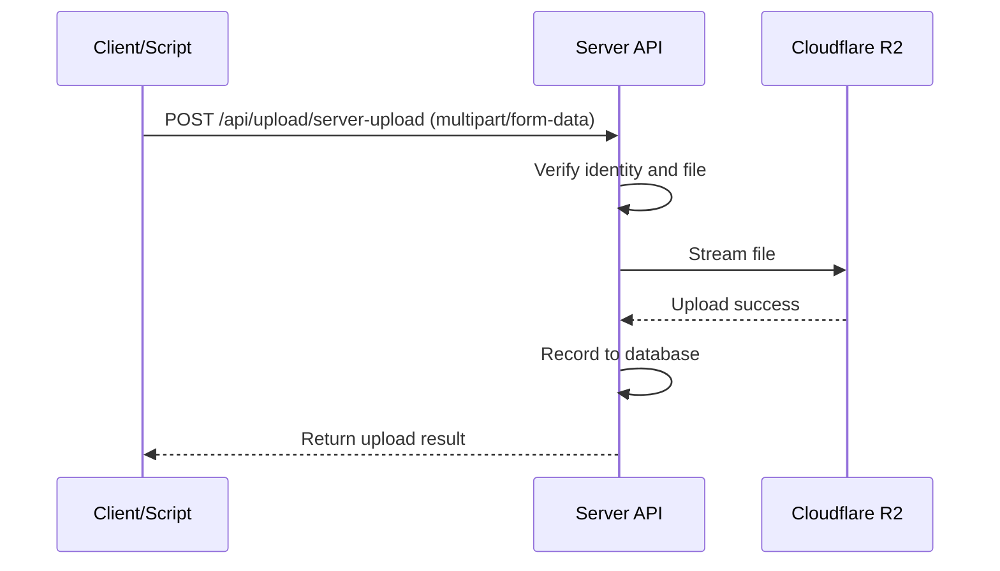

Checked against v0.1.16 on October 2, 2026, this guide follows the current production paths in the repository: Next.js 16 App Router, Better Auth, Stripe billing, PostgreSQL with Drizzle, Cloudflare R2 uploads, localized marketing pages, API keys, and browser-approved CLI device authentication. Use it as an implementation map, then verify every change with the repository's own lint, type-check, test, and build commands.

## 1. Project Overview

### 1.1. Project Introduction

**UllrAI SaaS Starter Kit** is a free, open-source, production-ready full-stack SaaS starter kit. It provides working authentication, billing, private uploads, and a localized application structure so you can build your product on existing boundaries.

- **Core Features**: Provides authentication, payment subscriptions, database management, file uploads, content management, and other core SaaS application features.
- **Agent-Friendly Positioning**: Built for browser users, APIs, local automation, and agent (OpenClaw, Codex, Claude Code, etc.) workflows from the same codebase.
- **Technology Stack**: Based on Next.js 16 App Router, TypeScript, PostgreSQL, Drizzle ORM, and integrates Stripe payments, Resend email service, and Cloudflare R2 file storage.
- **Use Cases**:
  - Quickly build full-stack SaaS applications requiring user login and paid subscription features.
  - As a practical project for learning modern full-stack web development technologies.
  - Use the existing permission and billing boundaries as a starting point for a product.
  - Independent developers or small teams quickly validate business ideas.

### 1.2. Quick Start

1.**Clone the project**

```bash
git clone https://github.com/UllrAI/SaaS-Starter.git
cd SaaS-Starter
```

2.**Install dependencies**

```bash
pnpm install
```

3.**Configure environment**
Copy `.env.example` to `.env` and fill in all required environment variables.

```bash
cp .env.example .env
```

4.**Sync database**
Make sure your local PostgreSQL database is running, then execute:

```bash
pnpm db:migrate
```

5.**Run development server**

```bash
pnpm dev
```

The application will run at `http://localhost:3000`. Use Node.js ≥22.12.0 and pnpm 10.33.0 as declared in `package.json`. In a second terminal, run `pnpm worker:dev` for durable background tasks. See the [Worker runbook](https://github.com/UllrAI/SaaS-Starter/blob/main/docs/background-jobs.md).

### 1.3. Feature List

- **Modern Framework**: Next.js 16 (App Router, RSC), React 19, TypeScript
- **UI**: Tailwind CSS v4, shadcn/ui, Lucide Icons, Dark/Light Mode
- **Authentication**: Better-Auth (Magic Link, OAuth - Google/GitHub/LinkedIn)
- **AI and durable tasks**: Optional AI assistant, typed tools, and PostgreSQL/pg-boss background execution; see the [AI guide](https://github.com/UllrAI/SaaS-Starter/blob/main/docs/ai-agent.md) and [Worker runbook](https://github.com/UllrAI/SaaS-Starter/blob/main/docs/background-jobs.md).
- **Machine Auth**: API keys, browser-approved CLI device login, CLI session review, versioned `/api/v1/*` endpoints
- **Database**: PostgreSQL + Drizzle ORM (Type-safe queries, Migration management)
- **Payment Subscriptions**: Stripe integration (One-time payments, Subscriptions, Customer portal, Webhooks)
- **File Upload**: Cloudflare R2 integration (Client-side presigned direct upload, Server-side proxy upload, Image compression)
- **Content Management**: Content Collections (Markdown blog system)
- **Email Service**: Resend + React Email (Transactional email templates)
- **Form Handling**: React Hook Form + Zod (Type-safe form validation)
- **Code Quality**: ESLint, Prettier, Jest, Playwright smoke tests
- **Admin Dashboard**: Dedicated users, payments, subscriptions, and uploads management pages
- **Agent-Friendly Workflow**: First-party `saas-cli`, API verification, and management surfaces for authorized devices
- **Deployment**: Zeabur reference deployment and standalone Docker image

### 1.4. Technical Architecture Diagram



---

## 2. In-Depth Technical Analysis

### 2.1. Directory Structure Breakdown

```
SaaS-Starter-main/
├── src/                  # All application source code
│   ├── app/              # Next.js App Router core directory
│   │   ├── (auth)/       # Authentication-related pages (login, signup)
│   │   ├── dashboard/    # Protected dashboard pages
│   │   ├── (pages)/      # Public pages (home, about, blog, etc.)
│   │   ├── api/          # API routes
│   │   ├── [locale]/     # Localized marketing root layout and pages
│   │   └── global-error.tsx # Root error fallback
│   ├── components/       # React components
│   │   ├── admin/        # Admin dashboard components
│   │   ├── auth/         # Authentication flow components
│   │   ├── blog/         # Blog-related components
│   │   ├── forms/        # Form components
│   │   ├── homepage/     # Homepage-specific components
│   │   └── ui/           # Generic UI components (based on shadcn/ui)
│   ├── database/         # Drizzle ORM related
│   │   ├── migrations/   # Database migration files
│   │   ├── config.ts     # Shared migration config
│   │   ├── index.ts      # Drizzle client initialization
│   │   └── schema.ts     # Database table structure definitions
│   ├── emails/           # React Email templates
│   ├── hooks/            # Custom React Hooks
│   ├── lib/              # Core logic and utility functions
│   │   ├── actions/      # Next.js Server Actions
│   │   ├── admin/        # Admin dashboard core logic
│   │   ├── auth/         # Authentication config and logic (Better-Auth)
│   │   ├── billing/      # Payment abstraction layer and providers (Stripe)
│   │   ├── config/       # Global constants, products, roles, etc.
│   │   ├── database/     # Database helper functions
│   │   ├── email.tsx     # Email sending service
│   │   └── r2.ts         # Cloudflare R2 file upload service
│   ├── schemas/          # Zod validation schemas
│   └── types/            # TypeScript type definitions
├── content/              # Repository-managed content (Markdown, JSON)
├── public/               # Static assets
├── scripts/              # Helper scripts (like setting up admin)
└── styles/               # Global styles and CSS
```

### 2.2. Core Module Analysis

#### 2.2.1. Entry Files and Startup Flow

- **Root layouts**: `src/app/(pages)/layout.tsx`, `src/app/[locale]/layout.tsx`, `src/app/(auth)/layout.tsx`, and `src/app/dashboard/layout.tsx` use `src/components/layout/app-document.tsx` for HTML, fonts, locale messages, structured data, and optional analytics.
  - Public layouts use `src/providers/marketing-providers.tsx` for theme support.
  - Auth and dashboard layouts use `src/components/app-providers.tsx` for theme support, the navigation loader, notifications, and client state providers.
- **`src/proxy.ts`**: Runs before requests reach pages, core for route protection.
  - Checks user session cookies.
  - Redirects to `/login` if user is not logged in but accessing `/dashboard/*`.
  - Canonicalizes locale-prefixed marketing URLs and forwards the active locale.
- **`src/app/dashboard/layout.tsx`**: Root layout for the dashboard.
  - Enforces authentication on the server with `requireAuth` before rendering protected content.
  - Renders `AppSidebar` and main content area `SidebarInset`.

#### 2.2.2. Configuration System Design

The project's configuration is highly centralized for easy maintenance and extension.

- **Environment Variables (`env.js`)**: Uses `@t3-oss/env-nextjs` to enforce environment variable validation. Web variables are validated against enabled features. The Worker validates its own subset in `src/lib/jobs/worker-env.ts`; migration commands only require database configuration. Use `.env.example` as the configuration checklist.
- **Feature switches (`src/lib/config/site.js`)**: Enable email auth, billing, uploads, and AI, and configure brand and repository links. Disabled integrations do not require their credentials.
- **Application Constants (`src/lib/config/constants.ts`)**: Exports names, contact addresses, repository links, and the billing provider from `SITE_CONFIG`.
- **Product Plans (`src/lib/config/products.ts`)**: Centrally defines internal tiers and prices. Stripe test and live Price IDs are isolated in `src/lib/billing/stripe/prices.ts` and generated by the catalog sync command.
- **User Roles (`src/lib/config/roles.ts`)**: Defines user roles and their hierarchical relationships (`user`, `admin`, `super_admin`). Helper functions like `hasRole` provide unified permission checking logic.
- **File Upload (`src/lib/config/upload.ts`)**: Centrally manages all file upload rules, including maximum file size, allowed file types, etc. All upload paths (client and server-side) share this configuration, ensuring rule consistency.

#### 2.2.3. Machine Auth and Agent Workflow

- **Web users**: Continue to use Better Auth sessions and dashboard route protection.
- **Machine clients**: Use versioned `/api/v1/*` endpoints and bearer tokens instead of browser cookies.
- **API keys**: Created and revoked inside the dedicated Developer Access page for scripts, integrations, and agents.
- **CLI device auth**: `saas-cli` starts a browser-approved device flow so local tools can sign in without copying browser session tokens.
- **Session review**: Authorized CLI sessions can be reviewed and revoked from the dedicated Developer Access page.

#### 2.2.4. Routing Architecture

The project uses Next.js App Router and leverages Route Groups for logical page separation.

- `(pages)`: Contains all public pages like home, about, blog, pricing, etc. Uses `src/app/(pages)/layout.tsx` to provide unified header and footer.
- `(auth)`: Contains authentication flow pages like login, signup. Uses `src/app/(auth)/layout.tsx` to provide a centered, clean layout.
- `dashboard`: Contains all pages requiring user login. Its layout enforces server-side route protection with `requireAuth`.
- `api/v1`: Contains versioned machine-facing auth endpoints for API verification, device approval, token exchange, and refresh.

#### 2.2.5. Build and Packaging Process

- **`next.config.ts`**: Next.js core configuration file.
  - Configures `images.remotePatterns` through `next-images.config.ts`. Private uploads are served through authenticated application URLs and skip server-side image optimization.
  - Integrates `@next/bundle-analyzer`. When `ANALYZE` environment variable is set to `true`, running `pnpm analyze` generates and opens bundle size analysis report after build, helping developers optimize frontend resource size.
- **`package.json`**:
  - `dev`: Runs `next dev`, using the framework's default Turbopack development mode.
  - `build`: Builds Next.js, bundles the Worker, and prepares the standalone output.
  - `start`: Runs the prepared standalone server; run `pnpm build` first.

---

## 3. Development Guide

### 3.1. Environment Setup

1. **Install Tools**:
   - Node.js 22.12.0 or higher.
   - pnpm (`npm install -g pnpm@10.33.0`).
   - PostgreSQL database (recommended using Docker: `docker run --name my-postgres -e POSTGRES_PASSWORD=mysecretpassword -p 5432:5432 -d postgres`).
1. **Clone and Install**:
   ```bash
   git clone https://github.com/UllrAI/SaaS-Starter.git
   cd SaaS-Starter
   pnpm install
   ```
1. **Configure Environment Variables**:
   - Copy `.env.example` to `.env`.
   - Generate a secure `BETTER_AUTH_SECRET`: `openssl rand -base64 32`.
   - Fill in your PostgreSQL `DATABASE_URL`.
   - Configure the credentials required by enabled integrations in `.env`: Stripe, Resend, private R2, and the AI endpoint. Review `.env.example` and feature switches rather than filling disabled integrations.
1. **Database Setup**:
   - **Disposable or personal development databases**: `pnpm db:push` synchronizes `src/database/schema.ts` directly. For a fresh environment using the committed application and queue migrations, use `pnpm db:migrate`.
   - **Shared environments**: generate and commit SQL migrations with `pnpm db:generate`; apply them once against the target `DATABASE_URL` before starting the new Web and Worker release. See the release procedure below.

### 3.2. Development Workflow

1. **Start Development Server**: `pnpm dev`
1. **Test agent-friendly auth locally**:
   - `pnpm saas-cli -- auth login --base-url http://localhost:3000`
   - `pnpm saas-cli -- auth status --base-url http://localhost:3000`
   - Or export `SAAS_CLI_API_KEY=ssk_...` for scripts and agent calls
1. **Modify Database**:
   - Edit `src/database/schema.ts`.
   - Use `pnpm db:push` only for disposable/personal iteration; generate committed migrations with `pnpm db:generate` before sharing the change.
1. **Create New Pages**:
   - Create marketing routes in `src/app/(pages)` and protected routes in `src/app/dashboard`.
1. **Create API Routes**:
   - Create new folders and `route.ts` files in the `src/app/api` directory.
1. **Create Server Actions**:
   - Create new files in the `src/lib/actions` directory using the `"use server";` directive.
1. **Code Checking**:
   - Run `pnpm lint` to check code style.
   - Run `pnpm prettier:format` to format code.

### 3.3. Code Standards

- **Naming Conventions**:
  - Components use PascalCase, e.g., `FileUploader`.
  - Functions and variables use camelCase.
  - Constants use UPPER_SNAKE_CASE.
- **File Organization**:
  - Page components are placed in their respective `app` route folders, usually in `_components` subdirectories.
  - Reusable components are placed in the `components` directory.
  - Logic, types, configurations are separated into `lib`, `types`, `schemas` directories.
- **Comment Requirements**:
  - Use JSDoc comments for complex functions or logic blocks.
  - Use inline comments for non-intuitive code.

---

## 4. Feature Module Details

### 4.1. Authentication System (Better-Auth)

This starter kit uses the `better-auth` library to provide a complete authentication solution.

- **Core Configuration**: `src/lib/auth/server.ts`
  - Configures Drizzle database adapter.
  - Dynamically loads social login providers (Google, GitHub, LinkedIn), only enabled when corresponding provider `CLIENT_ID` and `CLIENT_SECRET` are provided in `.env`.
  - Enables the `magicLink` plugin and Resend delivery when `SITE_CONFIG.features.emailAuth` is true.
- **API Route**: `src/app/api/auth/[...all]/route.ts`
  - This catch-all forwards Better Auth requests through `toNextJsHandler(auth.handler)`; browser admin POST endpoints are disabled. Use `authClient.signIn.magicLink` or `authClient.signIn.social` rather than inventing provider-specific login paths.
- **Client**: `src/lib/auth/client.ts`
  - Provides methods for interacting with the authentication system in client components, like `signIn`, `signOut`, `useSession`, etc.
- **Authentication Flow (Magic Link)**:

  ```mermaid
  sequenceDiagram
      participant User
      participant Client as Frontend (AuthForm)
      participant Server as Server (API)
      participant Resend as Email Service

      User->>Client: Enter email and click login
      Client->>Server: POST /api/auth/sign-in/magic-link
      Server->>Server: Generate time-limited Token
      Server->>Resend: Request to send email (with Token URL)
      Resend-->>User: Send magic link email
      User->>User: Click link in email
      Client->>Server: GET /api/auth/magic-link/verify?token=...
      Server->>Server: Verify Token, create session
      Server-->>Client: Set session Cookie and redirect to /dashboard
  ```

### 4.2. Database & ORM (Drizzle)

- **Schema Definition**: `src/database/schema.ts` is the single source of truth for all database tables, defining table structures, relationships, and constraints using Drizzle ORM syntax.
- **Client Initialization**: `src/database/index.ts` initializes the Drizzle client and applies different connection pool configurations based on environment (Serverless or traditional server) (`src/lib/database/connection.ts`).
- **Migration Management**:
  - The project maintains a single committed migration history in `src/database/migrations`.
  - `pnpm db:generate`: Generate SQL migration files based on changes in `schema.ts`.
  - `pnpm db:push`: Disposable/personal development only; syncs schema without generating a committed migration.
  - `pnpm db:migrate`: Apply committed migration files to the database selected by `DATABASE_URL`.

### 4.3. Payment & Subscriptions (Stripe)

- **Abstraction Layer**: `src/lib/billing/index.ts` exports a unified `billing` object so routes and actions stay independent from Stripe API details.
- **Provider Implementation**: `src/lib/billing/stripe/provider.ts` is the specific implementation for Stripe payment provider, encapsulating logic for creating checkout sessions, customer portals, and handling webhooks.
- **API Interfaces**:
  - `/api/billing/checkout`: Creates payment sessions. Returns `409 Conflict` status and management link when user tries to purchase existing subscription.
  - `/api/billing/portal`: Creates a URL to Stripe customer portal where users can manage their subscriptions.
  - `/api/billing/webhooks/stripe`: Receives webhook events from Stripe for updating subscription status, recording payments, etc.
- **Webhook Handling**: `src/lib/billing/stripe/webhook.ts`
  - **Security**: Uses Stripe's official SDK to verify the raw request body and `Stripe-Signature` header before processing any event.
  - **Idempotency**: Claims the provider event ID in `webhook_events` inside the same transaction as business changes; duplicate deliveries do not repeat the changes.
  - **Transactional**: Event processing and durable business changes are committed together. Required provider reads happen before the database transaction. See the [webhook runbook](https://github.com/UllrAI/SaaS-Starter/blob/main/docs/webhooks.md).
- **Payment Flow**:

  ```mermaid
  sequenceDiagram
      participant User
      participant Client as Frontend (Pricing Page)
      participant Server as Server
      participant Stripe

      User->>Client: Click "Get Plan"
      Client->>Server: POST /api/billing/checkout
      Server->>Stripe: Create Checkout Session
      Stripe-->>Server: checkoutUrl
      Server-->>Client: Return checkoutUrl
      Client->>User: Redirect to Stripe payment page
      User->>Stripe: Complete payment
      Stripe-->>Server: Webhook (checkout.session.completed)
      Server->>Server: Verify signature, record event
      Server->>Server: (DB Transaction) Update user subscription status
      User->>Client: Redirect to /payment-status
  ```

### 4.4. File Upload (Cloudflare R2)

The system supports two upload modes, providing optimal choices for different scenarios. All upload rules are centralized in `src/lib/config/upload.ts`.

#### 4.4.1. Client-side Presigned Upload (UI Recommended)

This is the default method used by the `FileUploader` component, offering better performance.

**Flow Diagram**:



#### 4.4.2. Server-side Proxy Upload

This mode allows server-side processing before storage.

**Flow Diagram**:



### 4.5. Blog & Content Management (Content Collections)

- **Content Pipeline**: Uses `Content Collections` to index repository-managed Markdown and JSON content under the `content/` directory.
- **Authoring Workflow**: Blog posts are edited directly in `content/blog/<locale>/*.md`, while author data lives in `content/authors/*.json`.
- **Content Reading**:
  - `content-collections.ts` defines the content schema and generated collections.
  - `src/app/(pages)/blog/page.tsx`: Blog list page, reads all indexed articles.
  - `src/app/(pages)/blog/[slug]/page.tsx`: Blog detail page, reads a single article and renders Markdown with `react-markdown`.

### 4.6. Admin Dashboard

Each business domain has its own management page and guarded actions.

- **Modular management pages**: Includes dedicated admin pages for users, payments, subscriptions, and uploads to keep each business domain isolated.
- **Unified permission guard**: All admin operations are protected by admin-level authorization checks.
- **Server Actions**: Users, payments, subscriptions, and uploads use domain actions in `src/lib/actions/admin/`, guarded by `shared.ts`.

---

## 5. Secondary Development Guide

### 5.1. Extension Point Identification

- **Add New Pages**: Create new routes in `src/app/(pages)` or `src/app/dashboard`.
- **Add New Admin Management Tables**:
  1. Define new table in `src/database/schema.ts`.
  1. Add a focused domain action module under `src/lib/actions/admin/` and reuse the `adminAction` guard from `shared.ts`.
  1. Create a dedicated management page under `src/app/dashboard/admin/` and add its navigation in `src/app/dashboard/_components/app-sidebar.tsx`.
- **Add New Payment Provider**:
  1. Create new provider implementation file under `src/lib/billing/`, must follow `PaymentProvider` interface in `src/lib/billing/provider.ts`.
  1. Register it in `src/lib/billing/index.ts`, then update `SITE_CONFIG.billing.provider` and its type in `src/lib/config/site.js`.
- **Customize Email Templates**: Create or modify React Email components in `src/emails/` directory.
- **Customize UI Components**: Modify `shadcn/ui` components or add new ones in `src/components/ui/`.

### 5.2. API Reference

| Route                          | Method    | Description                                       |
| ------------------------------ | --------- | ------------------------------------------------- |
| `/api/auth/[...all]`           | GET, POST | Handle all `better-auth` authentication requests. |
| `/api/billing/checkout`        | POST      | Create payment session.                           |
| `/api/billing/portal`          | GET       | Get customer portal URL.                          |
| `/api/billing/webhooks/stripe` | POST      | Receive Stripe webhook events.                    |
| `/api/upload/presigned-url`    | POST      | Get presigned URL for client-side direct upload.  |
| `/api/upload/server-upload`    | POST      | Server-side proxy file upload.                    |
| `/api/upload/complete`         | POST      | Verify the object and commit its upload intent.   |
| `/api/upload/cancel`           | POST      | Cancel an intent and release reserved quota.      |
| `/api/payment-status`          | GET       | Query payment status.                             |

### 5.3. Hooks and Events

- **`useSidebar()`**: Used in dashboard components to control sidebar expand/collapse state.
- **`useIsMobile()`**: Client-side hook to determine if current device is mobile size, safe for responsive components, avoiding SSR hydration errors.
- **`useAdminTable()`**: Core hook for driving admin dashboard table components. Encapsulates data fetching, pagination, search, filtering, and loading state management logic.
- **`onUploadComplete`**: Callback prop for `FileUploader` component, triggered after successful file upload.

---

## 6. Developer Toolchain

### 6.1. Testing Strategy

- **Frameworks**: Uses `Jest`, `React Testing Library`, and `Playwright`.
- **Configuration Files**: `jest.config.js`, `jest.setup.ts`, `playwright.config.ts`.
- **Unit and integration coverage**: Jest covers UI components, route handlers, hooks, auth helpers, billing helpers, upload logic, and dashboard pages.
- **Browser coverage**: Playwright exercises authentication, admin permissions, locale routing, machine auth, private files, AI, and background task flows using a dedicated `E2E_DATABASE_URL` whose database name contains `e2e` or `test`.
- **Examples**:
  - Unit/component: `src/components/forms/auth-form.test.tsx`
  - Page: `src/app/dashboard/page.test.tsx`
  - Route handler: `src/app/api/billing/checkout/route.test.ts`
  - Browser E2E: `e2e/auth.spec.ts`, `e2e/admin.spec.ts`, `e2e/locale.spec.ts`
- **Run Tests**:
  - `pnpm test`
  - `pnpm test:e2e`
- **Test-only session route**: Playwright enables `/api/test/session` only when `E2E_TEST_MODE=true` and an explicit `E2E_TEST_SECRET` of at least 32 characters is present. The route is disabled for non-local production deployments and signs the test cookie with that secret.

### 6.2. Code Quality Assurance

- **ESLint**: Configured in `eslint.config.mjs` using the flat config and `eslint-config-next`.
- **Prettier**: Runs separately from ESLint; `eslint-config-prettier` disables conflicting rules, and `prettier-plugin-tailwindcss` is used to auto-sort Tailwind CSS classes.
- **Run Checks**: `pnpm lint` and `pnpm prettier:check`.
- **Auto Format**: `pnpm prettier:format`.

### 6.3. Bundle Size Analysis

- Uses `@next/bundle-analyzer` to analyze production build bundle size.
- Run `pnpm analyze` to generate client and server analysis reports.
- This is crucial for identifying and optimizing large dependencies.

---

## 7. Real-world Application Scenarios

### 7.1. Typical Use Cases

- **Enterprise SaaS**: As starting point for new projects, provides user management, role permissions, and payments. Webhook records deduplicate billing events; they are not a general audit log.
- **AI Applications**: Build AI tools with login, subscription billing, and per-user AI admission limits. Usage-based billing requires your own product rules. File upload functionality can be used for processing user data.
- **Paid Content Platforms**: Public blog content and billing are available; paid-content authorization needs to be implemented for your product.
- **Internal Tools**: Leverage powerful admin dashboard and data management capabilities to quickly build company internal data management tools or dashboards.

---

## 8. Utility Tools

### 8.1. CLI Commands

| Script                 | Description                                |
| ---------------------- | ------------------------------------------ |
| `pnpm dev`             | Start development server (Turbo mode)      |
| `pnpm content:build`   | Generate Content Collections output        |
| `pnpm build`           | Build production application               |
| `pnpm start`           | Start production server                    |
| `pnpm lint`            | Run ESLint checks                          |
| `pnpm test`            | Run Jest unit tests                        |
| `pnpm test:e2e`        | Run Playwright E2E smoke tests             |
| `pnpm prettier:format` | Format all code                            |
| `pnpm db:generate`     | Generate committed migration files         |
| `pnpm db:migrate`      | Apply migrations to the current database   |
| `pnpm db:push`         | (Development only) Push schema to database |
| `pnpm analyze`         | Build and analyze bundle size              |
| `pnpm set:admin`       | Promote user to super admin                |

### 8.2. Configuration Options

Use `.env.example`, `env.js`, and [README](https://github.com/UllrAI/SaaS-Starter#readme) for required variables and feature gates. Configure credentials only for enabled integrations.

### 8.3. Utility Functions

`src/lib/utils.ts` provides some useful utility functions:

- `cn(...inputs)`: Safely merge Tailwind CSS class names and resolve conflicts.
- `formatCurrency(amount, currency, locale)`: Format amounts in cents to currency strings.
- `calculateReadingTime(text)`: Calculate estimated reading time based on text content.

---

## 9. Version Management & Updates

### 9.1. Dependency Management

- **Package Manager**: Project uses `pnpm`, ensure you have it installed globally. `pnpm` leverages content-addressable storage to save disk space and speed up installations.
- **Version Locking**: `pnpm-lock.yaml` file locks exact versions of all dependencies and their sub-dependencies, ensuring consistency across team members and different deployment environments.
- **Dependency Updates**: Review release notes and update dependencies deliberately. Major upgrades can change framework and SDK behavior; run repository checks before merging, and commit the updated lockfile.

---

## 10. Best Practices

### 10.1. Performance Optimization

- **Code Splitting**: Settings currently compose their tabs in `src/app/dashboard/settings/page.tsx`. Add dynamic imports only when measured bundle size or load time justifies them.
- **Image Optimization**: Use Next.js `<Image>` for public images. Private upload previews use `unoptimized` so the browser sends its session cookie to the authenticated file route.
- **Server Components**: Use React Server Components (RSC) as much as possible for data fetching and logic execution, reducing JavaScript code sent to client.
- **Database Queries**: Avoid executing database queries in loops. Leverage Drizzle ORM's join and batch operation capabilities to reduce database round trips.

### 10.2. Security Considerations

- **Environment Variables**: **Never** commit `.env` files to Git. Store production values in Zeabur's service variables or an equivalent secret manager.
- **Route Protection**: `src/proxy.ts` is the first line of defense, but **must** use functions like `requireAuth`, `requireAdmin` in Server Actions and API routes for backend permission verification.
- **SQL Injection**: Using Drizzle ORM effectively prevents SQL injection attacks when using its parameterized query API. Do not interpolate untrusted input into raw SQL.
- **XSS**: React escapes text nodes; the blog renderer does not enable raw HTML. Any new raw-HTML rendering path needs explicit validation and sanitization.
- **Webhook Security**: Signature verification in `src/lib/billing/stripe/webhook.ts` is key to ensuring webhook requests come from trusted sources.

### 10.3. Deployment Guide

The production reference uses Zeabur Web and Worker services tracking `prod`.
The default branch is for development and review. Follow the
[deployment runbook](https://github.com/UllrAI/SaaS-Starter/blob/main/docs/deployment-zeabur.md)
for service configuration, migration network access, backups, and recovery.

1. Merge the reviewed release commit into the default branch and wait for Quality on that exact SHA.
1. Configure Web and Worker variables from `.env.example`, and the GitHub `production` environment database secrets and migration tunnel settings from the runbook.
1. Create and push an annotated `release/vX.Y.Z` tag matching that commit's `package.json` version.
1. The promotion workflow verifies the tag and Quality, applies production migrations once, then updates `prod`. Do not separately run a routine manual production migration or push directly to `prod`.
1. Wait for both Zeabur services to deploy the same released SHA. Check Web `/api/health` and `/api/ready`, plus Worker readiness and runtime logs.
1. Verify both locale URL variants, authentication redirects, and an authenticated Dashboard session.

Migrations precede the new application processes; they do not run in every replica's startup command. Changes must remain compatible with the previous release while it is still serving traffic.

---

## 11. Community & Ecosystem

Before deploying, compare the [Next.js 16 architecture guide](/blog/nextjs-16-saas-starter-architecture), the [Stripe billing production guide](/blog/stripe-nextjs-billing-production-guide), and the [API key, OAuth, and device-flow guide](/blog/api-keys-oauth-device-flow-saas-agents). Then inspect the [feature boundaries](/features), review [pricing behavior](/pricing), and clone the [GitHub source](https://github.com/UllrAI/SaaS-Starter) instead of copying isolated snippets out of context.

### 11.1. Community Resources

- **Official Repository**: [UllrAI SaaS Starter on GitHub](https://github.com/UllrAI/SaaS-Starter)
- **Issues & Discussions**: Use GitHub Issues to submit bug reports and feature requests.
- **Main Dependency Documentation**:
  - [Next.js](https://nextjs.org/docs)
  - [Drizzle ORM](https://orm.drizzle.team/docs)
  - [Better-Auth](https://better-auth.com/docs)
  - [Stripe](https://docs.stripe.com)
  - [shadcn/ui](https://ui.shadcn.com/docs)
  - [Content Collections](https://www.content-collections.dev/)

### 11.2. Contribution Guidelines

We welcome community contributions!

1. Fork this project repository.
1. Create a new branch (`git checkout -b feature/your-feature-name`).
1. Make changes and commit (`git commit -m 'feat: Add some feature'`).
1. Push your branch to forked repository (`git push origin feature/your-feature-name`).
1. Create a Pull Request.

---

## 12. Troubleshooting

### 12.1. Common Issues FAQ

**Q: How do I add or update blog content?**

A: Add or edit Markdown files in `content/blog/` and update author JSON in `content/authors/` when needed. Run `pnpm content:build` if you want to regenerate the typed content output manually before testing or building.

**Q: File upload fails with CORS error.**

A: This is the most common file upload issue. Make sure you have correctly configured CORS policy in your Cloudflare R2 bucket settings, allowing the upload `PUT` from your deployment domain and `http://localhost:3000`, including the required `Content-Type` and `If-None-Match` headers. Keep the bucket private; browser downloads use authenticated app URLs.

**Q: How to set up the first admin account?**

A: The system doesn't automatically set up admins. You need to:

1. First register an account normally in the app with the email you want to make admin.
1. Run `pnpm set:admin --email=your-email@example.com` in your project root directory. The command loads `.env` when present and otherwise uses the current process environment.

**Q: Social login doesn't work, what to do?**

A: Please check the following:

1. Make sure you correctly filled in the corresponding social platform's `CLIENT_ID` and `CLIENT_SECRET` in the `.env` file.
1. Make sure in the social platform's OAuth app configuration (like Google Cloud Console, GitHub Developer Settings), you've added `http://localhost:3000/api/auth/callback/<provider>` and your production domain's callback URL to the authorized callback URL list.
