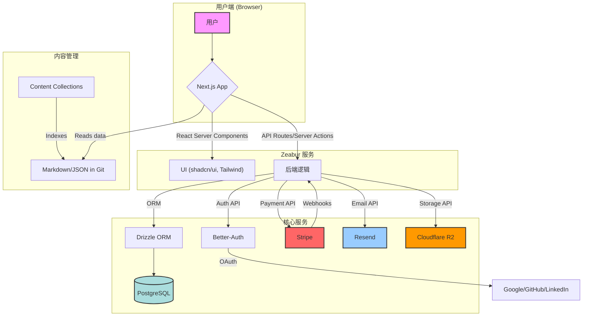
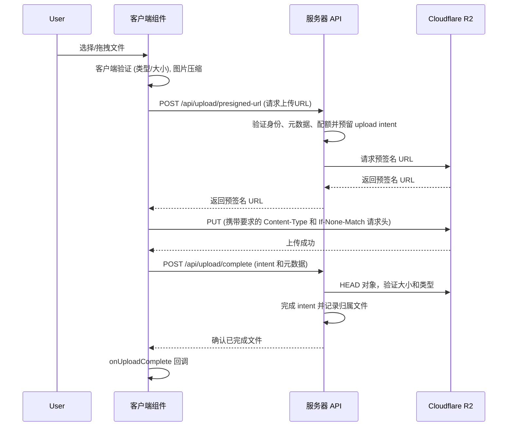
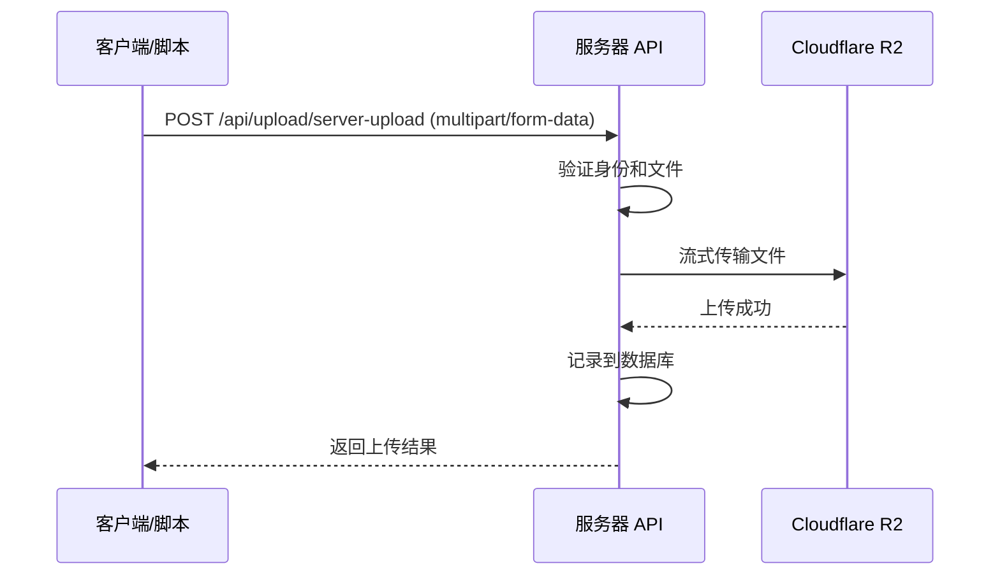

本文于 2026 年 10 月 2 日按 v0.1.16 的实际代码路径核对，覆盖 Next.js 16 App Router、Better Auth、Stripe 支付、PostgreSQL 与 Drizzle、Cloudflare R2 上传、多语言营销页、API Key，以及浏览器批准的 CLI 设备登录。请把它作为实现地图，并用仓库现有的 lint、类型检查、测试和构建命令验证每次改动。

## 1. 项目概览

### 1.1. 项目简介

**UllrAI SaaS Starter Kit** 是一个免费、开源、生产就绪的全栈 SaaS 入门套件。它提供可用的认证、计费、私有上传和多语言应用结构，方便在现有边界上开发产品。

- **核心功能**：提供身份验证、支付订阅、数据库管理、文件上传、内容管理等 SaaS 应用的核心功能。
- **Agent 友好定位**：同一套代码同时服务浏览器用户、API、终端自动化，以及 agent（OpenClaw、Codex、Claude Code 等）工作流。
- **技术栈**：基于 Next.js 16 App Router、TypeScript、PostgreSQL、Drizzle ORM，并集成了 Stripe 支付、Resend 邮件服务和 Cloudflare R2 文件存储。
- **适用场景**：
  - 快速搭建需要用户登录和付费订阅功能的全栈 SaaS 应用。
  - 作为学习现代全栈 Web 开发技术的实践项目。
  - 在现有权限和计费边界上启动产品。
  - 独立开发者或小型团队快速验证商业想法。

### 1.2. 快速开始

1.**克隆项目**

```bash
git clone https://github.com/UllrAI/SaaS-Starter.git
cd SaaS-Starter
```

2.**安装依赖**

```bash
pnpm install
```

3.**配置环境**
复制 `.env.example` 为 `.env` 并填入所有必需的环境变量。

```bash
cp .env.example .env
```

4.**同步数据库**
确保本地 PostgreSQL 数据库已启动，然后执行：

```bash
pnpm db:migrate
```

5.**运行开发服务器**

```bash
pnpm dev
```

应用将在 `http://localhost:3000` 上运行。按 `package.json` 使用 Node.js ≥22.12.0 和 pnpm 10.33.0。持久后台任务需要在另一个终端运行 `pnpm worker:dev`，详见 [Worker 说明](https://github.com/UllrAI/SaaS-Starter/blob/main/docs/background-jobs.md)。

### 1.3. 特性列表

- **现代框架**: Next.js 16 (App Router, RSC), React 19, TypeScript
- **UI**: Tailwind CSS v4, shadcn/ui, Lucide Icons, Dark/Light Mode
- **认证**: Better-Auth (魔法链接, OAuth - Google/GitHub/LinkedIn)
- **AI 与持久任务**: 可选 AI 助手、类型化工具与 PostgreSQL/pg-boss 后台执行，详见 [AI 说明](https://github.com/UllrAI/SaaS-Starter/blob/main/docs/ai-agent.md) 和 [Worker 说明](https://github.com/UllrAI/SaaS-Starter/blob/main/docs/background-jobs.md)。
- **机器认证**: API Key、浏览器批准的 CLI 设备登录、CLI 会话查看、版本化 `/api/v1/*` 接口
- **数据库**: PostgreSQL + Drizzle ORM (类型安全查询, 迁移管理)
- **支付订阅**: Stripe 集成 (一次性支付, 订阅, 客户门户, Webhooks)
- **文件上传**: Cloudflare R2 集成 (客户端预签名直传, 服务端代理上传, 图片压缩)
- **内容管理**: Content Collections (Markdown 博客系统)
- **邮件服务**: Resend + React Email (事务性邮件模板)
- **表单处理**: React Hook Form + Zod (类型安全的表单验证)
- **代码质量**: ESLint、Prettier、Jest、Playwright 冒烟测试
- **管理后台**: 用户、支付、订阅、上传的独立管理页面
- **Agent 友好工作流**: 内置一等公民 `saas-cli`、API 校验与已授权设备管理能力
- **部署**: Zeabur 参考部署与独立 Docker 镜像

### 1.4. 技术架构图



---

## 2. 深度技术分析

### 2.1. 目录结构详解

```
SaaS-Starter-main/
├── src/                  # 所有应用程序源代码
│   ├── app/              # Next.js App Router 核心目录
│   │   ├── (auth)/       # 认证相关页面 (登录、注册)
│   │   ├── dashboard/    # 受保护的仪表盘页面
│   │   ├── (pages)/      # 公开页面 (首页、关于、博客等)
│   │   ├── api/          # API 路由
│   │   ├── [locale]/     # 本地化营销根布局与页面
│   │   └── global-error.tsx # 根级错误页面
│   ├── components/       # React 组件
│   │   ├── admin/        # 管理后台相关组件
│   │   ├── auth/         # 认证流程组件
│   │   ├── blog/         # 博客相关组件
│   │   ├── forms/        # 表单组件
│   │   ├── homepage/     # 首页专用组件
│   │   └── ui/           # 通用 UI 组件 (基于 shadcn/ui)
│   ├── database/         # Drizzle ORM 相关
│   │   ├── migrations/   # 数据库迁移文件
│   │   ├── config.ts     # 共享迁移配置
│   │   ├── index.ts      # Drizzle 客户端初始化
│   │   └── schema.ts     # 数据库表结构定义
│   ├── emails/           # React Email 邮件模板
│   ├── hooks/            # 自定义 React Hooks
│   ├── lib/              # 核心逻辑与工具函数
│   │   ├── actions/      # Next.js Server Actions
│   │   ├── admin/        # 管理后台核心逻辑
│   │   ├── auth/         # 认证配置与逻辑 (Better-Auth)
│   │   ├── billing/      # 支付抽象层与提供商 (Stripe)
│   │   ├── config/       # 全局常量、产品、角色等配置
│   │   ├── database/     # 数据库辅助函数
│   │   ├── email.tsx     # 邮件发送服务
│   │   └── r2.ts         # Cloudflare R2 文件上传服务
│   ├── schemas/          # Zod 验证 schema
│   └── types/            # TypeScript 类型定义
├── content/              # 仓库管理的内容 (Markdown, JSON)
├── public/               # 静态资源
├── scripts/              # 辅助脚本 (如设置管理员)
└── styles/               # 全局样式与 CSS
```

### 2.2. 核心模块分析

#### 2.2.1. 入口文件和启动流程

- **根布局**: `src/app/(pages)/layout.tsx`、`src/app/[locale]/layout.tsx`、`src/app/(auth)/layout.tsx` 和 `src/app/dashboard/layout.tsx` 共用 `src/components/layout/app-document.tsx`，负责 HTML、字体、语言消息、结构化数据与可选分析。
  - 公开布局使用 `src/providers/marketing-providers.tsx` 提供主题。
  - 认证与 dashboard 布局使用 `src/components/app-providers.tsx` 提供主题、导航加载条、通知和客户端状态 providers。
- **`src/proxy.ts`**: 在请求到达页面之前运行，是实现路由保护的核心。
  - 检查用户会话 Cookie。
  - 如果用户未登录但访问 `/dashboard/*`，重定向到 `/login`。
  - 规范化带语言前缀的营销 URL，并转发当前语言。
- **`src/app/dashboard/layout.tsx`**: 仪表盘的根布局。
  - 在服务端使用 `requireAuth` 校验身份，未通过前不会渲染受保护内容。
  - 渲染 `AppSidebar` 和主内容区域 `SidebarInset`。

#### 2.2.2. 配置系统设计

项目的配置高度集中化，便于维护和扩展。

- **环境变量 (`env.js`)**: 使用 `@t3-oss/env-nextjs` 强制校验环境变量。Web 按已启用功能校验变量；Worker 在 `src/lib/jobs/worker-env.ts` 校验所需子集，迁移命令只需要数据库配置。使用 `.env.example` 核对配置。
- **功能开关 (`src/lib/config/site.js`)**: 配置邮件认证、计费、上传、AI、品牌和仓库链接。禁用的集成无需其凭据。
- **应用常量 (`src/lib/config/constants.ts`)**: 从 `SITE_CONFIG` 导出名称、联系邮箱、仓库链接和支付提供商。
- **产品套餐 (`src/lib/config/products.ts`)**: 统一定义内部套餐和价格。Stripe 测试与生产 Price ID 分别保存在 `src/lib/billing/stripe/prices.ts`，并由产品目录同步命令生成。
- **用户角色 (`src/lib/config/roles.ts`)**: 定义了用户角色及其层级关系（`user`, `admin`, `super_admin`）。`hasRole` 等辅助函数提供了统一的权限检查逻辑。
- **文件上传 (`src/lib/config/upload.ts`)**: 集中管理文件上传的所有规则，包括最大文件大小、允许的文件类型等。所有上传路径（客户端和服务器端）都共享此配置，确保规则一致性。

#### 2.2.3. 机器认证与 Agent 工作流

- **Web 用户**：继续使用 Better Auth session 和 dashboard 路由保护。
- **机器客户端**：通过版本化 `/api/v1/*` bearer token 接口访问，而不是复用浏览器 cookie。
- **API Key**：可在独立的 Developer Access 页面中创建与撤销，适合脚本、集成和 agent 调用。
- **CLI 设备登录**：`saas-cli` 通过浏览器批准的 device flow 登录，本地工具无需复制浏览器 session token。
- **会话管理**：已授权 CLI 会话可以在独立的 Developer Access 页面中查看和撤销。

#### 2.2.4. 路由架构

项目采用 Next.js App Router，并利用路由组 (Route Groups) 对页面进行逻辑隔离。

- `(pages)`: 存放所有对公众可见的页面，如首页、关于、博客、定价等。使用 `src/app/(pages)/layout.tsx` 提供统一的页头和页脚。
- `(auth)`: 存放认证流程中的页面，如登录、注册。使用 `src/app/(auth)/layout.tsx` 提供一个居中、简洁的布局。
- `dashboard`: 存放所有需要用户登录才能访问的页面，其布局通过服务端 `requireAuth` 实现路由保护。
- `api/v1`: 存放面向机器客户端的版本化认证接口，包括 API 校验、设备批准、token 换取与刷新。

#### 2.2.5. 构建和打包流程

- **`next.config.ts`**: Next.js 的核心配置文件。
  - 通过 `next-images.config.ts` 配置 `images.remotePatterns`。私有上传使用应用鉴权地址，并跳过服务端图片优化。
  - 集成了 `@next/bundle-analyzer`。当环境变量 `ANALYZE` 设置为 `true` 时，运行 `pnpm analyze` 会在构建后生成并打开包体积分析报告，帮助开发者优化前端资源大小。
- **`package.json`**:
  - `dev`: 运行 `next dev`，使用框架默认的 Turbopack 开发模式。
  - `build`: 构建 Next.js、打包 Worker 并准备 standalone 产物。
  - `start`: 运行准备好的 standalone 服务；先执行 `pnpm build`。

---

## 3. 开发指南

### 3.1. 环境搭建

1. **安装工具**:
   - Node.js 22.12.0 或更高版本。
   - pnpm (`npm install -g pnpm@10.33.0`)。
   - PostgreSQL 数据库 (推荐使用 Docker: `docker run --name my-postgres -e POSTGRES_PASSWORD=mysecretpassword -p 5432:5432 -d postgres`)。
1. **克隆和安装**:
   ```bash
   git clone https://github.com/UllrAI/SaaS-Starter.git
   cd SaaS-Starter
   pnpm install
   ```
1. **配置环境变量**:
   - 复制 `.env.example` 到 `.env`。
   - 生成一个安全的 `BETTER_AUTH_SECRET`: `openssl rand -base64 32`。
   - 填入您的 PostgreSQL `DATABASE_URL`。
   - 在 `.env` 中配置已启用集成需要的 Stripe、Resend、私有 R2 和 AI 接口凭据。对照 `.env.example` 与功能开关核对，不必填写已禁用集成。
1. **数据库设置**:
   - **可丢弃或个人开发数据库**: `pnpm db:push` 直接同步 `src/database/schema.ts`。全新环境使用已提交的应用与队列迁移时，执行 `pnpm db:migrate`。
   - **共享环境**: 使用 `pnpm db:generate` 生成并提交 SQL 迁移；新 Web 与 Worker 启动前，对目标 `DATABASE_URL` 执行一次 `pnpm db:migrate`。详见后文发布流程。

### 3.2. 开发流程

1. **启动开发服务器**: `pnpm dev`
1. **本地测试 Agent 友好鉴权链路**:
   - `pnpm saas-cli -- auth login --base-url http://localhost:3000`
   - `pnpm saas-cli -- auth status --base-url http://localhost:3000`
   - 或导出 `SAAS_CLI_API_KEY=ssk_...` 给脚本和 agent 调用
1. **修改数据库**:
   - 编辑 `src/database/schema.ts`。
   - 仅在可丢弃或个人数据库上使用 `pnpm db:push` 迭代；共享改动前用 `pnpm db:generate` 生成可提交迁移。
1. **创建新页面**:
   - 营销页放在 `src/app/(pages)`；受保护页面放在 `src/app/dashboard`，并创建对应的 `page.tsx`。
1. **创建 API 路由**:
   - 在 `src/app/api` 目录下创建新的文件夹和 `route.ts` 文件。
1. **创建 Server Action**:
   - 在 `src/lib/actions` 目录下创建新文件，使用 `"use server";` 指令。
1. **代码检查**:
   - 运行 `pnpm lint` 检查代码风格。
   - 运行 `pnpm prettier:format` 格式化代码。

### 3.3. 代码规范

- **命名规范**:
  - 组件使用帕斯卡命名法 (PascalCase)，例如 `FileUploader`。
  - 函数和变量使用驼峰命名法 (camelCase)。
  - 常量使用大写蛇形命名法 (UPPER_SNAKE_CASE)。
- **文件组织**:
  - 页面组件放置在各自的 `src/app` 路由文件夹下，通常在 `_components` 子目录中。
  - 可复用组件放置在 `src/components` 目录下。
  - 逻辑、类型、配置等分离到 `src/lib`, `src/types`, `src/schemas` 目录中。
- **注释要求**:
  - 对复杂函数或逻辑块使用 JSDoc 注释。
  - 对非直观的代码进行行内注释。

---

## 4. 功能模块详解

### 4.1. 认证系统 (Better-Auth)

本脚手架使用 `better-auth` 库提供了一套完整的认证解决方案。

- **核心配置**: `src/lib/auth/server.ts`
  - 配置了 Drizzle 数据库适配器。
  - 动态加载社交登录提供商 (Google, GitHub, LinkedIn)，只有在 `.env` 中提供了对应提供商的 `CLIENT_ID` 和 `CLIENT_SECRET` 时才会启用。
  - 在 `SITE_CONFIG.features.emailAuth` 开启时启用 `magicLink` 插件，并通过 Resend 发送邮件。
- **API 路由**: `src/app/api/auth/[...all]/route.ts`
  - 该 catch-all 通过 `toNextJsHandler(auth.handler)` 转发 Better Auth 请求，浏览器 admin POST 入口被禁用。调用 `authClient.signIn.magicLink` 或 `authClient.signIn.social`，不要自行拼接提供商登录路径。
- **客户端**: `src/lib/auth/client.ts`
  - 提供了在客户端组件中与认证系统交互的方法，如 `signIn`, `signOut`, `useSession` 等。
- **认证流程 (Magic Link 魔法链接)**:

  ```mermaid
  sequenceDiagram
      participant User
      participant Client as 客户端 (AuthForm)
      participant Server as 服务器 (API)
      participant Resend as 邮件服务

      User->>Client: 输入邮箱并点击登录
      Client->>Server: POST /api/auth/sign-in/magic-link
      Server->>Server: 生成有时效的 Token
      Server->>Resend: 请求发送邮件 (含 Token URL)
      Resend-->>User: 发送魔法链接邮件
      User->>User: 点击邮件中的链接
      Client->>Server: GET /api/auth/magic-link/verify?token=...
      Server->>Server: 验证 Token, 创建会话
      Server-->>Client: 设置会话 Cookie 并重定向到 /dashboard
  ```

### 4.2. 数据库与 ORM (Drizzle)

- **Schema 定义**: `src/database/schema.ts` 是所有数据库表的单一事实来源，使用 Drizzle ORM 的语法定义表结构、关系和约束。
- **客户端初始化**: `src/database/index.ts` 负责初始化 Drizzle 客户端，并根据环境（Serverless 或传统服务器）应用不同的连接池配置 (`src/lib/database/connection.ts`)。
- **迁移管理**:
  - 项目维护一套提交到仓库的迁移历史，位于 `src/database/migrations`。
  - `pnpm db:generate`: 基于 `schema.ts` 的变化生成 SQL 迁移文件。
  - `pnpm db:push`: 仅限可丢弃或个人开发数据库，直接同步 schema，不生成可提交迁移。
  - `pnpm db:migrate`: 对 `DATABASE_URL` 指向的数据库应用已提交的迁移文件。

### 4.3. 支付与订阅 (Stripe)

- **抽象层**: `src/lib/billing/index.ts` 导出统一的 `billing` 对象，使路由与操作逻辑不依赖 Stripe API 细节。
- **提供商实现**: `src/lib/billing/stripe/provider.ts` 是 Stripe 支付提供商的具体实现，封装了创建 Checkout 会话、客户门户和处理 Webhook 的逻辑。
- **API 接口**:
  - `/api/billing/checkout`: 创建支付会话。在用户尝试购买已有的订阅时，会返回 `409 Conflict` 状态码和管理链接。
  - `/api/billing/portal`: 创建一个指向 Stripe 客户门户的 URL，用户可以在此管理自己的订阅。
  - `/api/billing/webhooks/stripe`: 接收来自 Stripe 的 Webhook 事件，用于更新订阅状态、记录付款等。
- **Webhook 处理**: `src/lib/billing/stripe/webhook.ts`
  - **安全**: 使用 Stripe 官方 SDK 验证原始请求体和 `Stripe-Signature` 请求头，再处理事件。
  - **幂等性**: 在业务变更的同一事务中认领 `webhook_events` 的平台事件 ID，重复投递不会重复修改业务数据。
  - **事务性**: 事件处理与业务变更在同一事务提交；必要的支付平台读取在事务前执行。详见 [Webhook 说明](https://github.com/UllrAI/SaaS-Starter/blob/main/docs/webhooks.zh-CN.md)。
- **支付流程图**:

  ```mermaid
  sequenceDiagram
      participant User
      participant Client as 客户端 (Pricing Page)
      participant Server as 服务器
      participant Stripe

      User->>Client: 点击 "Get Plan"
      Client->>Server: POST /api/billing/checkout
      Server->>Stripe: Create Checkout Session
      Stripe-->>Server: checkoutUrl
      Server-->>Client: 返回 checkoutUrl
      Client->>User: 重定向到 Stripe 支付页
      User->>Stripe: 完成支付
      Stripe-->>Server: Webhook (checkout.session.completed)
      Server->>Server: 验证签名, 记录事件
      Server->>Server: (DB Transaction) 更新用户订阅状态
      User->>Client: 重定向到 /payment-status
  ```

### 4.4. 文件上传 (Cloudflare R2)

系统支持两种上传模式，为不同场景提供最佳选择。所有上传规则集中在 `src/lib/config/upload.ts`。

#### 4.4.1. 客户端预签名上传 (UI 推荐)

这是通过 `FileUploader` 组件使用的默认方式，性能更高。

**流程图**:



#### 4.4.2. 服务器端代理上传

此模式允许在存储前进行服务器端处理。

**流程图**:



### 4.5. 博客与内容管理 (Content Collections)

- **内容管线**: 使用 `Content Collections` 为 `content/` 目录下的 Markdown 和 JSON 内容建立索引。
- **编写方式**: 直接编辑 `content/blog/<locale>/*.md` 博客文章，并在 `content/authors/*.json` 中维护作者信息。
- **内容读取**:
  - `content-collections.ts` 定义内容 schema 和生成的集合。
  - `src/app/(pages)/blog/page.tsx`: 博客列表页，读取所有索引后的文章。
  - `src/app/(pages)/blog/[slug]/page.tsx`: 博客详情页，读取单篇文章，并使用 `react-markdown` 渲染 Markdown 内容。

### 4.6. 管理后台 (Admin Dashboard)

各业务域都有独立管理页面与权限受控的操作。

- **模块化管理页面**: 提供用户、支付、订阅、上传等独立后台页面，便于按业务域演进功能。
- **统一权限控制**: 后台操作统一受管理员权限校验保护。
- **Server Actions**: 用户、支付、订阅和上传分别使用 `src/lib/actions/admin/` 下的业务模块，并复用 `shared.ts` 的权限校验。

---

## 5. 二次开发指南

### 5.1. 扩展点识别

- **添加新页面**: 在 `src/app/(pages)` 或 `src/app/dashboard` 中创建新路由。
- **添加新后台管理表**:
  1. 在 `src/database/schema.ts` 中定义新表。
  1. 在 `src/lib/actions/admin/` 下添加业务模块，复用 `shared.ts` 的 `adminAction` 权限校验。
  1. 在 `src/app/dashboard/admin/` 下新增对应管理页面并在 `src/app/dashboard/_components/app-sidebar.tsx` 中添加导航链接。
- **添加新支付提供商**:
  1. 在 `src/lib/billing/` 下创建新的提供商实现文件，需遵循 `src/lib/billing/provider.ts` 的 `PaymentProvider` 接口。
  1. 在 `src/lib/billing/index.ts` 注册实现，再更新 `src/lib/config/site.js` 的 `SITE_CONFIG.billing.provider` 及其类型。
- **自定义邮件模板**: 在 `src/emails/` 目录下创建或修改 React Email 组件。
- **自定义 UI 组件**: 在 `src/components/ui/` 中修改 `shadcn/ui` 组件或添加新组件。

### 5.2. API 参考

| 路由                           | 方法      | 描述                              |
| ------------------------------ | --------- | --------------------------------- |
| `/api/auth/[...all]`           | GET, POST | 处理所有 `better-auth` 认证请求。 |
| `/api/billing/checkout`        | POST      | 创建支付会话。                    |
| `/api/billing/portal`          | GET       | 获取客户门户 URL。                |
| `/api/billing/webhooks/stripe` | POST      | 接收 Stripe Webhook 事件。        |
| `/api/upload/presigned-url`    | POST      | 为客户端直传获取预签名 URL。      |
| `/api/upload/server-upload`    | POST      | 服务器端代理上传文件。            |
| `/api/upload/complete`         | POST      | 验证对象并完成 upload intent。    |
| `/api/upload/cancel`           | POST      | 取消 intent 并释放预留配额。      |
| `/api/payment-status`          | GET       | 查询支付状态。                    |

### 5.3. Hook 和事件

- **`useSidebar()`**: 在仪表盘组件中用于控制侧边栏的展开/折叠状态。
- **`useIsMobile()`**: 客户端 hook，用于判断当前设备是否为移动端尺寸，可安全用于响应式组件，避免 SSR 水合错误。
- **`useAdminTable()`**: 核心 hook，用于驱动管理后台的表格组件。它封装了数据获取、分页、搜索、过滤和加载状态管理的逻辑。
- **`onUploadComplete`**: `FileUploader` 组件的回调 prop，在文件成功上传后触发。

---

## 6. 开发者工具链

### 6.1. 测试策略

- **框架**: 使用 `Jest`、`React Testing Library` 和 `Playwright`。
- **配置文件**: `jest.config.js`、`jest.setup.ts`、`playwright.config.ts`。
- **单元与集成覆盖**: Jest 覆盖 UI 组件、路由处理器、hooks、认证辅助函数、计费逻辑、上传逻辑和 dashboard 页面。
- **浏览器覆盖**: Playwright 覆盖认证、管理员权限、locale 路由、机器认证、私有文件、AI 和后台任务。必须使用独立的 `E2E_DATABASE_URL`，数据库名称包含 `e2e` 或 `test`。
- **示例**:
  - 单元/组件: `src/components/forms/auth-form.test.tsx`
  - 页面: `src/app/dashboard/page.test.tsx`
  - 路由处理器: `src/app/api/billing/checkout/route.test.ts`
  - 浏览器 E2E: `e2e/auth.spec.ts`、`e2e/admin.spec.ts`、`e2e/locale.spec.ts`
- **运行测试**:
  - `pnpm test`
  - `pnpm test:e2e`
- **测试专用会话路由**: Playwright 仅在 `E2E_TEST_MODE=true` 且提供至少 32 个字符的显式 `E2E_TEST_SECRET` 时启用 `/api/test/session`。非本机生产部署会禁用该入口，测试 cookie 会使用该密钥签名。

### 6.2. 代码质量保障

- **ESLint**: 配置在 `eslint.config.mjs` 中，采用 flat config 和 `eslint-config-next`。
- **Prettier**: 独立运行，`eslint-config-prettier` 关闭冲突规则，`prettier-plugin-tailwindcss` 自动排序 Tailwind CSS 类。
- **运行检查**: `pnpm lint` 和 `pnpm prettier:check`。
- **自动格式化**: `pnpm prettier:format`。

### 6.3. 包体积分析

- 使用 `@next/bundle-analyzer` 分析生产构建的包体积。
- 运行 `pnpm analyze` 来生成客户端和服务端的分析报告。
- 这对于识别和优化大型依赖项至关重要。

---

## 7. 实际应用场景

### 7.1. 典型使用场景

- **企业级 SaaS**: 作为新项目的起点，提供用户管理、角色权限和支付。Webhook 记录用于计费事件去重，不是通用审计日志。
- **AI 应用**: 构建有登录、订阅计费和用户 AI 请求配额的工具；按用量计费需要自己的产品规则。文件上传功能可用于处理用户数据。
- **内容付费平台**: 已有公开博客与计费；付费内容的访问权限需要按产品需求实现。
- **内部工具**: 利用其强大的管理后台和数据管理能力，快速搭建公司内部的数据管理工具或仪表盘。

---

## 8. 实用工具

### 8.1. CLI 命令

| 脚本                   | 描述                              |
| ---------------------- | --------------------------------- |
| `pnpm dev`             | 启动开发服务器（Turbo 模式）      |
| `pnpm content:build`   | 生成 Content Collections 内容输出 |
| `pnpm build`           | 构建生产应用                      |
| `pnpm start`           | 启动生产服务器                    |
| `pnpm lint`            | 运行 ESLint 检查                  |
| `pnpm test`            | 运行 Jest 单元测试                |
| `pnpm test:e2e`        | 运行 Playwright E2E 冒烟测试      |
| `pnpm prettier:format` | 格式化所有代码                    |
| `pnpm db:generate`     | 生成可提交的迁移文件              |
| `pnpm db:migrate`      | 对当前数据库应用迁移              |
| `pnpm db:push`         | (仅开发) 将 Schema 推送到数据库   |
| `pnpm analyze`         | 构建并分析包体积                  |
| `pnpm set:admin`       | 提升用户为超级管理员              |

### 8.2. 配置选项

通过 `.env.example`、`env.js` 和 [README](https://github.com/UllrAI/SaaS-Starter#readme) 核对变量与功能开关，只配置已启用集成的凭据。

### 8.3. 工具函数

`src/lib/utils.ts` 中提供了一些实用的工具函数：

- `cn(...inputs)`: 安全地合并 Tailwind CSS 类名，并解决冲突。
- `formatCurrency(amount, currency, locale)`: 将以分为单位的金额格式化为货币字符串。
- `calculateReadingTime(text)`: 根据文本内容计算预计阅读时间。

---

## 9. 版本管理与升级

### 9.1. 依赖管理

- **包管理器**: 项目使用 `pnpm`，请确保您已全局安装。`pnpm` 利用其内容寻址存储来节省磁盘空间并加快安装速度。
- **版本锁定**: `pnpm-lock.yaml` 文件锁定了所有依赖项及其子依赖项的精确版本，确保了团队成员和不同部署环境之间的一致性。
- **依赖更新**: 查看发行说明后有针对性地升级依赖。主要版本升级可能改变框架或 SDK 行为；合并前运行仓库检查，并提交更新后的 lockfile。

---

## 10. 最佳实践

### 10.1. 性能优化

- **代码分割**: 当前设置页在 `src/app/dashboard/settings/page.tsx` 组合各个 tab。只有实际包体积或加载耗时需要时才添加动态导入。
- **图片优化**: 公共图片可使用 Next.js `<Image>`。私有上传预览使用 `unoptimized`，由浏览器携带会话 cookie 请求鉴权文件路由。
- **服务器组件**: 尽可能使用 React Server Components (RSC) 来获取数据和执行逻辑，减少发送到客户端的 JavaScript 代码量。
- **数据库查询**: 避免在循环中执行数据库查询。利用 Drizzle ORM 的 join 和批量操作能力来减少数据库往返次数。

### 10.2. 安全考虑

- **环境变量**: **绝不**将 `.env` 文件提交到 Git 仓库。生产值应存储在 Zeabur 服务变量或同等的密钥管理工具中。
- **路由保护**: `src/proxy.ts` 是第一道防线，但**必须**在 Server Actions 和 API 路由中使用 `requireAuth`、`requireAdmin` 等函数进行后端权限验证。
- **SQL 注入**: 使用 Drizzle ORM 可以有效防止 SQL 注入攻击，前提是使用参数化查询 API；不要将未经验证的输入拼接到 raw SQL。
- **XSS**: React 会转义文本节点，博客渲染不启用原始 HTML。新增原始 HTML 渲染路径时需要明确验证与清理。
- **Webhook 安全**: `src/lib/billing/stripe/webhook.ts` 中的签名验证是确保 Webhook 请求来源可信的关键。

### 10.3. 部署指南

生产参考使用 Zeabur Web 与 Worker 服务，两者都跟踪 `prod`。
默认分支用于开发和审查。服务配置、迁移网络访问、备份与恢复以
[部署 runbook](https://github.com/UllrAI/SaaS-Starter/blob/main/docs/deployment-zeabur.md)
为准。

1. 将审查后的发布提交合并到默认分支，并等待 Quality 在该确切 SHA 上通过。
1. 按 `.env.example` 配置 Web 与 Worker 变量，按 runbook 配置 GitHub `production` 环境数据库 secrets 和迁移隧道设置。
1. 在该提交上创建并推送与其 `package.json` 版本一致的 `release/vX.Y.Z` 附注标签。
1. 晋升 workflow 验证标签与 Quality，单次执行生产迁移，然后更新 `prod`。常规发布无需再手动迁移，也不要直接 push 到 `prod`。
1. 等待两个 Zeabur 服务部署同一个发布 SHA。检查 Web `/api/health`、`/api/ready`，以及 Worker 就绪和运行日志。
1. 验证两种语言 URL、认证重定向和已登录 Dashboard 会话。

迁移先于新应用进程执行，不放在每个副本的启动命令中。旧版本仍提供服务时，迁移需要兼容其读写。

---

## 11. 社区与生态

部署前，请对照 [Next.js 16 架构指南](/blog/nextjs-16-saas-starter-architecture)、[Stripe 生产级支付指南](/blog/stripe-nextjs-billing-production-guide) 与 [API Key、OAuth 和设备流选型指南](/blog/api-keys-oauth-device-flow-saas-agents)，再检查[功能边界](/zh-Hans/features)、验证[价格与结账行为](/zh-Hans/pricing)，并从 [GitHub 源码](https://github.com/UllrAI/SaaS-Starter)完整克隆项目，而不是脱离上下文复制零散代码。

### 11.1. 社区资源

- **官方仓库**: [UllrAI SaaS Starter on GitHub](https://github.com/UllrAI/SaaS-Starter)
- **问题与讨论**: 使用 GitHub Issues 提交 Bug 报告和功能请求。
- **主要依赖文档**:
  - [Next.js](https://nextjs.org/docs)
  - [Drizzle ORM](https://orm.drizzle.team/docs)
  - [Better-Auth](https://better-auth.com/docs)
  - [Stripe](https://docs.stripe.com)
  - [shadcn/ui](https://ui.shadcn.com/docs)
  - [Content Collections](https://www.content-collections.dev/)

### 11.2. 贡献指南

我们欢迎社区的贡献！

1. Fork 本项目仓库。
1. 创建一个新的分支 (`git checkout -b feature/your-feature-name`)。
1. 进行修改并提交 (`git commit -m 'feat: Add some feature'`)。
1. 将您的分支推送到 Fork 的仓库 (`git push origin feature/your-feature-name`)。
1. 创建一个 Pull Request。

---

## 12. 问题解决

### 12.1. 常见问题 FAQ

**Q: 如何新增或更新博客内容？**

A: 直接编辑 `content/blog/` 中的 Markdown 文件，并在需要时更新 `content/authors/` 下的作者 JSON。若要手动刷新带类型的内容输出，可运行 `pnpm content:build`，然后再测试或构建。

**Q: 文件上传失败，提示 CORS 错误。**

A: 这是最常见的文件上传问题。请确保您已在 Cloudflare R2 存储桶的设置中正确配置了 CORS 策略，允许来自部署域名和 `http://localhost:3000` 的上传 `PUT`，包括要求的 `Content-Type` 与 `If-None-Match` 请求头。存储桶保持私有；浏览器下载使用应用鉴权地址。

**Q: 如何设置第一个管理员账户？**

A: 系统不会自动设置管理员。您需要：

1. 先用您想设为管理员的邮箱在应用中正常注册一个账户。
1. 在项目根目录运行 `pnpm set:admin --email=your-email@example.com`。该命令在存在时会加载 `.env`，否则直接使用当前进程环境变量。

**Q: 社交登录不工作怎么办？**

A: 请检查以下几点：

1. 确保您在 `.env` 文件中正确填写了对应社交平台的 `CLIENT_ID` 和 `CLIENT_SECRET`。
1. 确保在社交平台（如 Google Cloud Console, GitHub Developer Settings）的 OAuth 应用配置中，已将 `http://localhost:3000/api/auth/callback/<provider>` 和您生产域名的回调 URL 添加到授权回调 URL 列表中。
